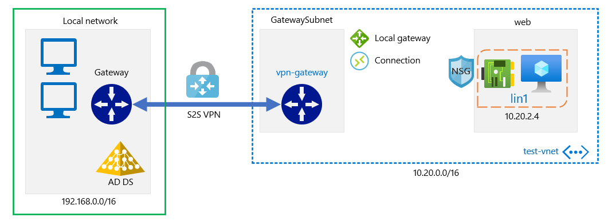

# Site to Site VPN Connection

## Why a Site-to-Site VPN

- Secure connection between Local environment and Azure environment
- Not all Azure services require VPN, Azure ARC uses TCP Port 443 and TLS encryption
- Generally S2S VPN is the way to create secure connection

VPN is a secure connection over an unsecured medium, the internet

### Requirements

- 2 x VPN Gateway nodes = 1 in Edge of On-Prem network + 1 Azure VPN Gateway in a delegated subnet called "GatewaySubnet"
  - Gateway subnet also contains
    - Local Gateway - Stores on Premises network ranges for routing, Public IP address of Azure VPN device
    - 1 or more types connections - handshake using **Pre-shared key (PSK)** between local Gateway and Gateway in Azure
